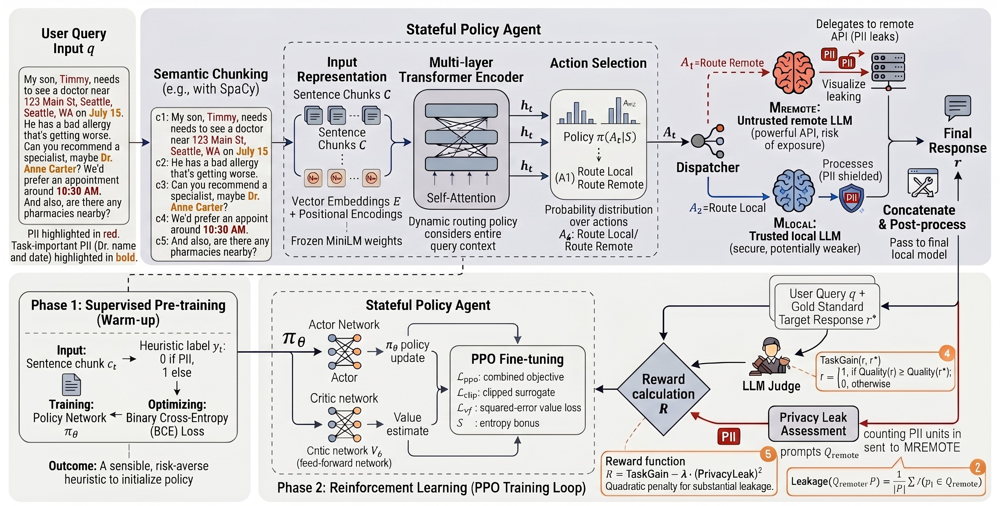

<div align="center">

# Privacy-R1

### Privacy-Aware Multi-LLM Agent Collaboration via Reinforcement Learning

[](https://arxiv.org/abs/2510.16054)
[](https://2026.aclweb.org/)
[](#dataset-files)
[](#statistics)
[](#overview)

**Zheng Hui**&nbsp;&nbsp;·&nbsp;&nbsp;**Yijiang River Dong**&nbsp;&nbsp;·&nbsp;&nbsp;**Sanhanat Sivapiromrat**&nbsp;&nbsp;·&nbsp;&nbsp;**Ehsan Shareghi**&nbsp;&nbsp;·&nbsp;&nbsp;**Nigel Collier**

University of Cambridge&nbsp;&nbsp;|&nbsp;&nbsp;University College London

<sub>`zh2483@columbia.edu` · `{yd358, ss3229, es776, nhc30}@cam.ac.uk`</sub>

</div>

---

<div align="center">

<br>
<sub><b>Figure 1.</b> Privacy-R1 reframes Privacy-Conscious Delegation as a sequential decision-making problem, learning a policy that routes each query chunk to a local or remote model to balance privacy leakage against task utility.</sub>
</div>


---

## Abstract

When users submit queries to Large Language Models, their prompts often contain sensitive data,
forcing a difficult choice: send the query to a powerful proprietary model for state-of-the-art
performance and risk data exposure, or rely on a smaller local model that guarantees privacy but
degrades task performance. Prior approaches rely on static rewriting pipelines that shatter
linguistic coherence and indiscriminately remove privacy-sensitive (often task-critical) content.
**Privacy-R1** reformulates this challenge (Privacy-Conscious Delegation) as a sequential
decision-making problem and trains a reinforcement-learning agent to **dynamically route text
chunks** between local and remote models, implicitly distinguishing *replaceable* PII (shielded
locally) from *task-critical* PII (strategically revealed for utility). To validate the approach in
a complex setting, we introduce **Med-PCD**, a new medical dataset with high PII density.

---

## This Repository

This repository releases the **Med-PCD** dataset (Medical Privacy-Conscious Delegation) introduced
in the paper — a benchmark designed to stress-test privacy-preserving LLM systems in a high-stakes
domain where real medical queries are dense with interconnected PII.

Med-PCD is built on the publicly available, already-anonymized
[**MedDialog**](https://aclanthology.org/2020.emnlp-main.743/) patient–doctor dialogues. We use a
LLM to **synthetically inject** a diverse, coherent set of PII into the
anonymized patient messages — preserving the original informal "real patient" writing style and
**without altering any medical facts** — then generate a gold-standard target response per query.

> **All PII in Med-PCD is entirely synthetic and does not correspond to any real individual.**

---

## The Task: Privacy-Conscious Delegation

A trusted **local** model acts as a proxy that may delegate parts of a user query to a powerful but
**untrusted remote** model, aiming to maximize answer quality while minimizing PII exposure. Each
Med-PCD instance provides everything needed to evaluate this trade-off:

- **`query`** — the user prompt `q`, rich with PII.
- **`pii_units`** — the set of PII units `P = {p₁, …, p_k}` used to measure **Privacy Leakage**:

  $$\text{Leakage} = \frac{1}{|P|}\sum_{i=1}^{k} \mathbb{1}\big(p_i \in Q'_{\text{remote}}\big)$$

- **`target_response`** — the gold response `r*`, i.e. the powerful model's answer given the *full*
  query. It is the **quality ceiling** against which a system's response is judged for **Quality
  Preservation** (`TaskGain`).

---

## Dataset Files

```
med_pcd_dataset/
├── med_pcd_all.json     # all 1020 instances
├── med_pcd_train.json   # 816 instances  (split == "train")
├── med_pcd_test.json    # 204 instances  (split == "test")
└── stats.json           # summary statistics
```

### Record schema

| Field | Type | Description |
|------|------|-------------|
| `id` | `string` | Unique instance id, e.g. `med-pcd-00001` |
| `query` | `string` | PII-injected patient message (the user query `q`) |
| `pii_units` | `string[]` | Distinct PII surface strings `P`; each is an exact substring of `query` |
| `num_pii` | `int` | Number of PII units, `|P|` |
| `target_response` | `string` | Gold response `r*` from the powerful model |
| `split` | `string` | `"train"` or `"test"` |

---

## Statistics

| Metric | Med-PCD (this release) | Paper (Table 1) |
|---|---:|---:|
| # Instances | 1020 | 1020 |
| Train / Test | 816 / 204 | 816 / 204 |
| Domain | Medical | Medical |
| Avg. # PII per instance | **4.57** | 4.6 |
| Avg. query length (chars) | **1492.1** | 1533.2 |
| Avg. response length (chars) | **2181.3** | 1920 |

Every PII unit is verified to appear verbatim in its query. The per-instance PII count ranges from
3 to 8, concentrated around 4–5.

---

## Example

A single instance (`med-pcd-00001`, abbreviated). Note the deliberately preserved casual register,
lowercase, and typos — Med-PCD mirrors how patients actually write.

```jsonc
{
  "id": "med-pcd-00001",
  "query": "hi, this is melissa grant, dob 04/18/1989, i know this is prob a dumb question but i keep reading different things and im getting myself all confused. i believe the incubation period for covid 19 is 7 days. so if you get sick after 7 days does the 14 say quarantine period starts ... my number is 215-555-4078 and email is mel.g89@protonmail.com if they need to reply that way ...",
  "pii_units": [
    "melissa grant",
    "04/18/1989",
    "dr. reena patel",
    "keystone family clinic",
    "215-555-4078",
    "mel.g89@protonmail.com"
  ],
  "num_pii": 6,
  "target_response": "Hi Melissa — great question, and not a dumb one at all. The incubation period is *included* in the quarantine window ...",
  "split": "train"
}
```

---

## Loading the data

```python
import json

with open("med_pcd_dataset/med_pcd_train.json", encoding="utf-8") as f:
    train = json.load(f)

ex = train[0]
query        = ex["query"]            # user prompt q (contains PII)
pii_units    = ex["pii_units"]        # ground-truth PII set P
gold_answer  = ex["target_response"]  # quality ceiling r*

# Example: compute privacy leakage of a delegated prompt
def leakage(remote_prompt: str, pii_units: list[str]) -> float:
    if not pii_units:
        return 0.0
    exposed = sum(p in remote_prompt for p in pii_units)
    return exposed / len(pii_units)
```

---

## How Med-PCD Was Built

1. **Source.** Anonymized patient–doctor dialogues from MedDialog (English COVID subset).
2. **PII injection.** Each anonymized patient message is passed to LLM with a few-shot prompt
   (reproduced from the paper's Appendix A) that injects a diverse set of PII — names, DOBs, MRNs,
   phones, emails, doctors, clinics, departments, insurance, pharmacies, dates, addresses,
   cities/states, travel and workplace details — while:
   - **preserving the original informal style** (lowercase, abbreviations, spelling errors,
     run-on sentences);
   - **keeping every medical fact, symptom, diagnosis, and timeline unchanged**; and
   - **maintaining internal consistency** (e.g. any injected DOB agrees with a stated age).
3. **Gold responses.** Each fully PII-injected query is sent to the same powerful model to produce
   the target response `r*`, representing the quality a privacy-preserving system aims to match.

In the paper, a human validation study over 240 instances found **98.8%** of instances judged as a
"pass" for contextual coherence and logical consistency (Fleiss' κ = 0.89).

---

## Ethical Use

- Med-PCD builds on MedDialog, a **publicly available, already-anonymized** resource. No real
  patient information is present.
- **All injected PII is synthetic** and generated by an LLM; it does not refer to real people.
- This dataset is intended **solely for research on privacy-preserving NLP systems**. Please use it
  responsibly and in accordance with the source data's terms.

---

## Citation

If you use Med-PCD or Privacy-R1, please cite:

```bibtex
@inproceedings{hui2026privacyr1,
  title     = {Privacy-R1: Privacy-Aware Multi-LLM Agent Collaboration via Reinforcement Learning},
  author    = {Hui, Zheng and Dong, Yijiang River and Sivapiromrat, Sanhanat and
               Shareghi, Ehsan and Collier, Nigel},
  booktitle = {Proceedings of the 64th Annual Meeting of the Association for
               Computational Linguistics (ACL)},
  year      = {2026},
  note      = {arXiv:2510.16054},
  url       = {https://arxiv.org/abs/2510.16054}
}
```

